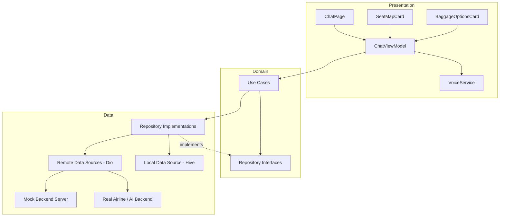

# Architecture

The module follows **Clean Architecture** in a **Feature-First** layout:
`presentation → domain → data`, with dependencies only ever pointing
inward (presentation and data both depend on domain; domain depends on
nothing else in the module).

## Component diagram

## Layer responsibilities

| Layer | Contains | Depends on |
|---|---|---|
| **Presentation** | `ChatPage`, card widgets, `ChatViewModel`/`ChatState` | Domain only (entities, use cases) |
| **Domain** | Entities, repository interfaces, use cases | Nothing outside the module |
| **Data** | DTOs (Freezed), data sources (Dio/Hive), repository implementations | Domain (to implement its interfaces) |

The **ViewModel is the only place intent routing happens**: it classifies
a user utterance, picks the matching use case, and turns the result into a
`ChatMessage` the UI renders via `RichCardWidget`. Widgets never call a
repository or use case directly except through the ViewModel — e.g.
`SeatMapCard` calls `ChatViewModel.confirmSeatChange`, not
`SeatRepository.changeSeat`.

## Why this shape

- **Swappable AI provider**: `ChatRepository` doesn't know about OpenAI
  specifically — `OpenAiChatRemoteDataSource` is one implementation of
  `ChatRemoteDataSource`; a different provider is a new class, no domain
  changes.
- **Swappable backend**: every data source has a `Mock*` and a `Dio*`
  implementation; `useMockBackendProvider` in `core/di/providers.dart`
  flips all of them at once.
- **Testable in isolation**: use cases and the ViewModel depend on
  interfaces, so unit tests substitute mocktail doubles instead of hitting
  Dio, Hive, or platform channels (see `test/` and `docs/SETUP_GUIDE.md`).
- **Host-app integration is one seam**: `AiTravelAssistantEntryPoint.route()`
  is the only thing a host app needs to call.

See `docs/SEQUENCE_DIAGRAMS.md` for how a seat-selection and baggage-purchase
turn flow through these layers, and `docs/CLASS_DIAGRAM.md` for the entity
relationships.
