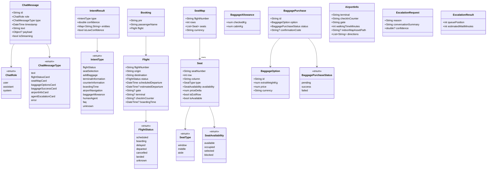
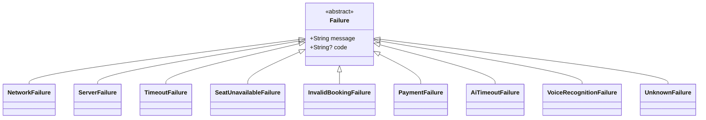

# Class Diagram — Domain Entities

## Failure hierarchy

`Result<T>` (`Success<T>` / `ResultFailure<T>`) wraps either a value or a
`Failure`; `safeCall` is the single place data-layer exceptions
(`DioException`, `SeatUnavailableException`, `PaymentDeclinedException`,
`AiTimeoutException`, `InvalidBookingException`) get mapped onto this
hierarchy — see `lib/core/utils/safe_call.dart`.
