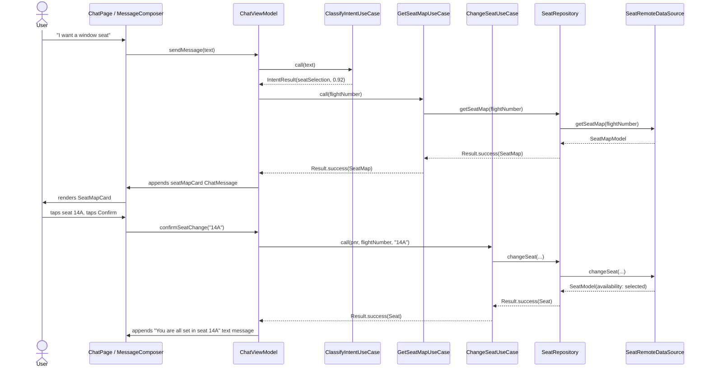
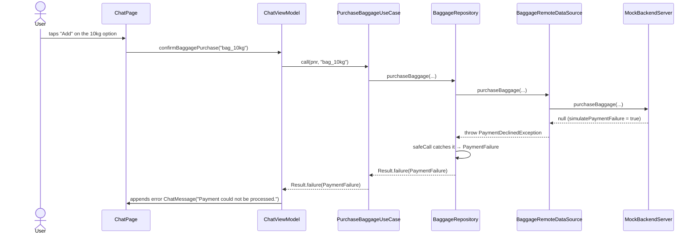
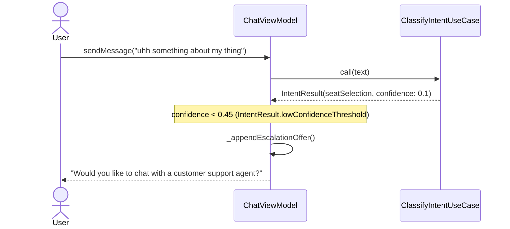

# Sequence Diagrams

## 1. Seat selection

```mermaid
sequenceDiagram
    actor User
    participant UI as ChatPage / MessageComposer
    participant VM as ChatViewModel
    participant CI as ClassifyIntentUseCase
    participant GS as GetSeatMapUseCase
    participant CS as ChangeSeatUseCase
    participant Repo as SeatRepository
    participant DS as SeatRemoteDataSource

    User->>UI: "I want a window seat"
    UI->>VM: sendMessage(text)
    VM->>CI: call(text)
    CI-->>VM: IntentResult(seatSelection, 0.92)
    VM->>GS: call(flightNumber)
    GS->>Repo: getSeatMap(flightNumber)
    Repo->>DS: getSeatMap(flightNumber)
    DS-->>Repo: SeatMapModel
    Repo-->>GS: Result.success(SeatMap)
    GS-->>VM: Result.success(SeatMap)
    VM->>UI: appends seatMapCard ChatMessage
    UI->>User: renders SeatMapCard

    User->>UI: taps seat 14A, taps Confirm
    UI->>VM: confirmSeatChange("14A")
    VM->>CS: call(pnr, flightNumber, "14A")
    CS->>Repo: changeSeat(...)
    Repo->>DS: changeSeat(...)
    DS-->>Repo: SeatModel(availability: selected)
    Repo-->>CS: Result.success(Seat)
    CS-->>VM: Result.success(Seat)
    VM->>UI: appends "You are all set in seat 14A" text message
```

## 2. Baggage purchase (with a simulated payment failure)

```mermaid
sequenceDiagram
    actor User
    participant UI as ChatPage
    participant VM as ChatViewModel
    participant PB as PurchaseBaggageUseCase
    participant Repo as BaggageRepository
    participant DS as BaggageRemoteDataSource
    participant Server as MockBackendServer

    User->>UI: taps "Add" on the 10kg option
    UI->>VM: confirmBaggagePurchase("bag_10kg")
    VM->>PB: call(pnr, "bag_10kg")
    PB->>Repo: purchaseBaggage(...)
    Repo->>DS: purchaseBaggage(...)
    DS->>Server: purchaseBaggage(...)
    Server-->>DS: null  (simulatePaymentFailure = true)
    DS-->>Repo: throw PaymentDeclinedException
    Repo->>Repo: safeCall catches it → PaymentFailure
    Repo-->>PB: Result.failure(PaymentFailure)
    PB-->>VM: Result.failure(PaymentFailure)
    VM->>UI: appends error ChatMessage("Payment could not be processed.")
```

## 3. Low-confidence intent → human escalation offer

```mermaid
sequenceDiagram
    actor User
    participant VM as ChatViewModel
    participant CI as ClassifyIntentUseCase

    User->>VM: sendMessage("uhh something about my thing")
    VM->>CI: call(text)
    CI-->>VM: IntentResult(seatSelection, confidence: 0.1)
    Note over VM: confidence < 0.45 (IntentResult.lowConfidenceThreshold)
    VM->>VM: _appendEscalationOffer()
    VM-->>User: "Would you like to chat with a customer support agent?"
```
