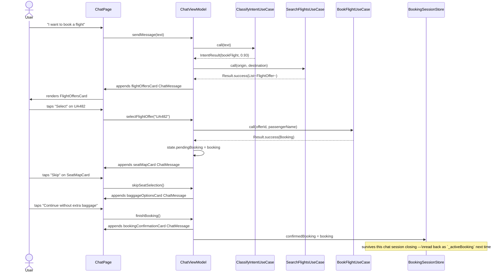
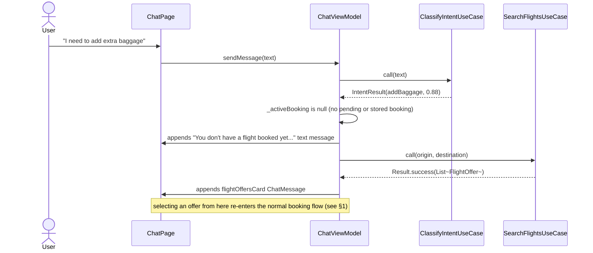
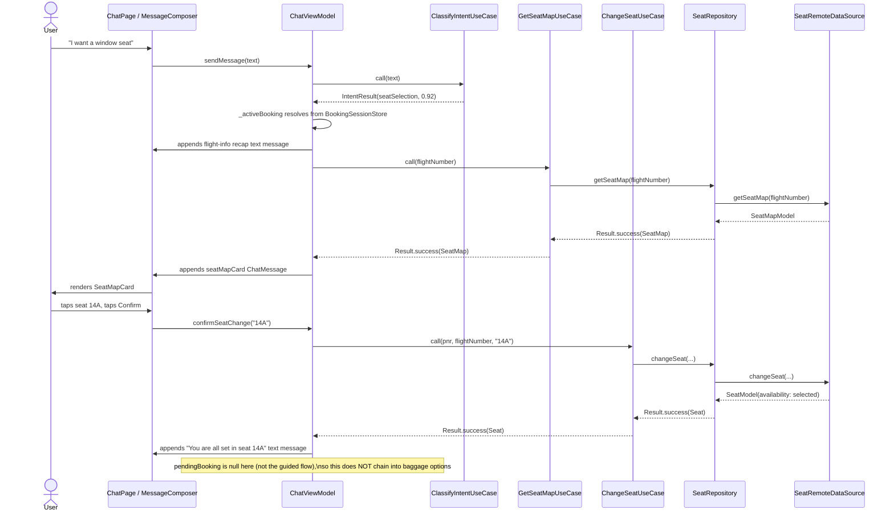
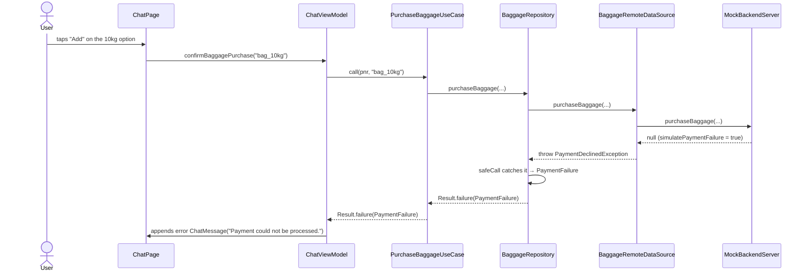
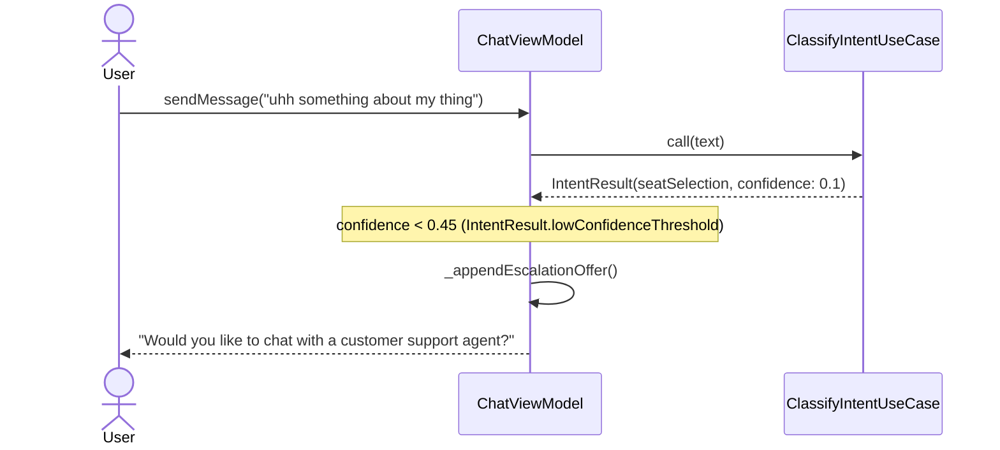

# Sequence Diagrams

## 1. Book a flight, skipping seat & baggage

Flight options are never shown proactively — they only appear once the
passenger asks to book (or taps the "Book a Flight" quick action). From
there the passenger can skip straight through seat selection and baggage to
a confirmed itinerary; the confirmed booking is then remembered across chat
sessions via `BookingSessionStore`.

## 2. Seat/baggage request with no booking yet

If the passenger asks for something that requires an active flight (seat,
baggage, status, airport info) before booking one — and no booking is
stored in `BookingSessionStore` either — the assistant says so and offers
to start a booking instead of guessing at a demo flight.

## 3. Seat selection (returning passenger, already booked)

Assumes `_activeBooking` resolves to a booking already confirmed in a
previous session (via `BookingSessionStore`) rather than one still pending
in the guided flow — this is what a passenger typing "I want a window seat"
in a *new* chat session hits.

## 4. Baggage purchase (with a simulated payment failure)

## 5. Low-confidence intent → human escalation offer

